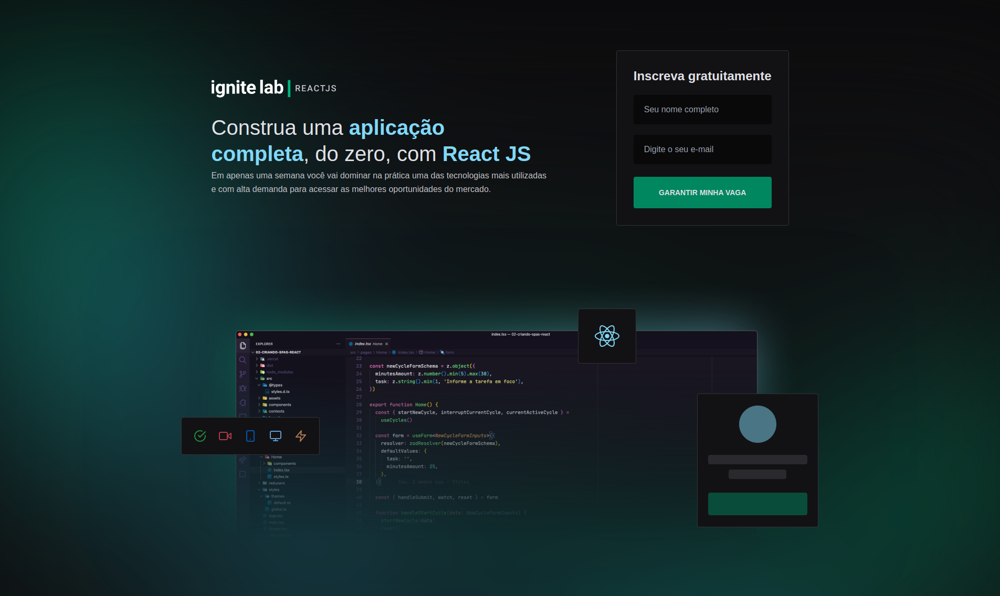
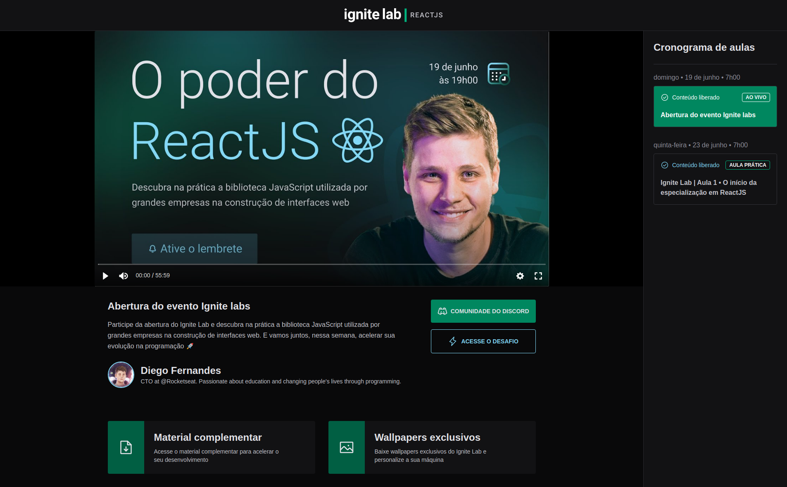
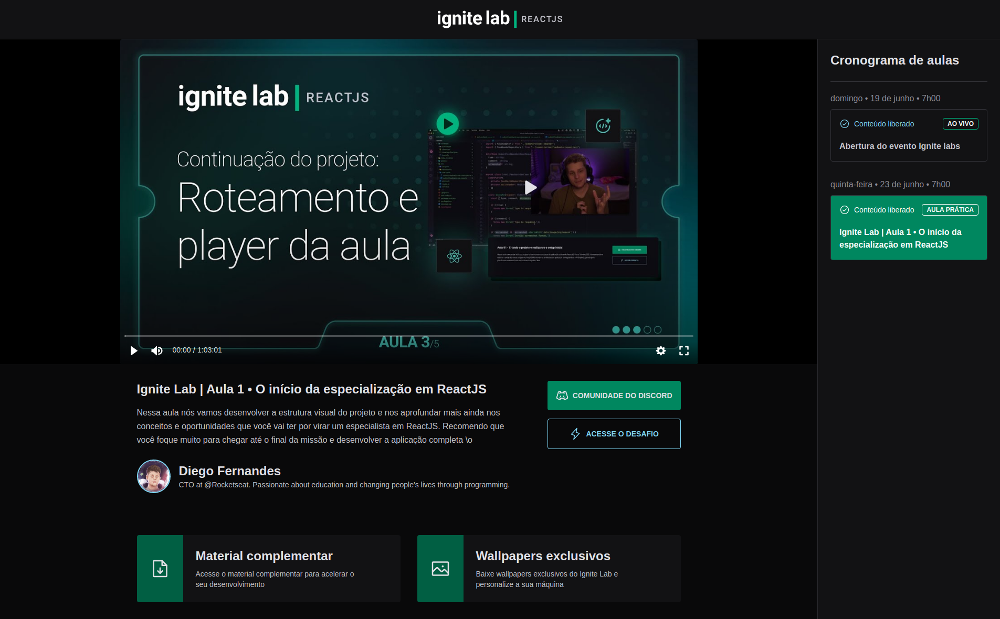

<h2 align="center">
  <div>
    
  <div>
</h2>

<h1 align="center">
    Event Platform. | Ignite-Lab#2
</h1>

<p align="center">
  <a href="https://andrejr.dev">
    
  </a>
</p>

<p align="center"> Aplicação desenvolvida durante o Ignite lab #2 💻🚀 </p>

<p align="center">
  <a href="#rocket-tecnologias">Tecnologias</a>&nbsp;&nbsp;&nbsp;|&nbsp;&nbsp;&nbsp;
  <a href="#information_source-como-instalar">Como instalar</a>&nbsp;&nbsp;&nbsp;
</p>

<h1 align="center">
    
  <div style="display: flex; flex-direction: row;">
    
    
  <div>
</h1>
<br />

## :rocket: Tecnologias

Este projeto foi desenvolvido com as seguintes tecnologias:

- [ReactJS](https://reactjs.org)
- [NodeJS](https://nodejs.org/en/)
- [Yarn](https://yarnpkg.com) or Npm
- [VSCode](https://code.visualstudio.com)
- [Git Bash](https://gitforwindows.org/)
- [Graphql](https://graphql.org/)
- [Tailwindcss](https://tailwindcss.com/)
- [GraphCMS](https://graphcms.com/)

## :information_source: Como instalar

Para clonar e executar este aplicativo, você precisará do [Git](https://git-scm.com) instalado em seu computador. Da sua linha de comando:

```bash
# Clonar este repositório
$ git clone https://github.com/andrejr971/event-platform.git

# Navegue até o repositório
$ cd event-platform

#instale os pacotes
$ yarn
# ou
$ npm install

# atualize o arquivo .env.example com as suas credenciais do graphcms

# renomei o aquivo .env.example para .env.local

# Execute a aplicação em modo de desenvolvimento
$ yarn dev
# ou
$ npm run dev

# A aplicação será aberta na porta:3000 - acesse http://localhost:300
http://localhost:3000
```

---

Feito by André Junior :wave: [portifólio](https://andrejr.dev)
